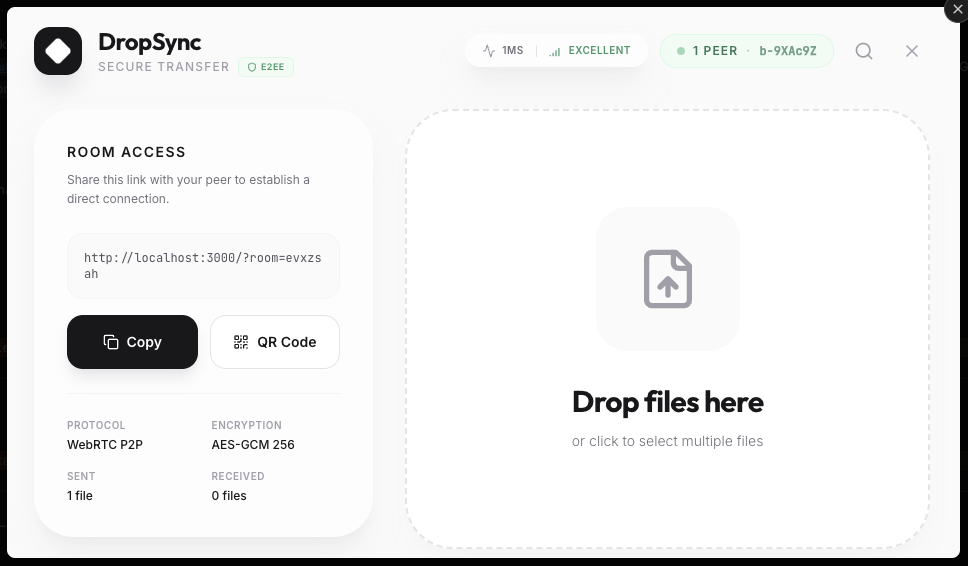

# DropSync

> Browser-to-browser P2P file sharing and chat. No cloud, no storage, no limits.



## What it does

DropSync creates a direct encrypted tunnel between two browsers using WebRTC. Files and messages travel peer-to-peer — nothing touches a server.

- **No file size limits** — stream gigabytes directly between devices
- **End-to-end encrypted** — optional AES-GCM 256 encryption with PBKDF2-derived keys
- **Password-protected rooms** — HMAC-SHA256 challenge-response handshake before any data flows
- **Real-time chat** — P2P text chat over the same signaling data channel
- **Transfer history** — track sent/received files with resend support
- **QR code sharing** — scan to join from mobile
- **Peer info** — live latency, signal quality, and peer IP from WebRTC ICE stats

## Stack

| Layer | Tech |
|---|---|
| Frontend | React 19, TypeScript, Tailwind CSS v4, Framer Motion |
| Transport | WebRTC data channels |
| Signaling | Socket.IO (Express server) |
| Crypto | Web Crypto API (AES-GCM, PBKDF2, HMAC-SHA256) |
| Bundler | Vite |

## Run locally

**Prerequisites:** Node.js 18+

```bash
npm install
npm run dev
```

The app runs at `http://localhost:3000`.

Open a second browser tab/window, navigate to the same URL, and you'll be connected peer-to-peer.

## How it works

1. **Creator** opens the app, optionally sets a room password, and clicks **Create Secure Room**
2. A room ID is generated and appended to the URL (`?room=<id>`)
3. **Joiner** opens the shared URL, enters the room password if required
4. Socket.IO relays the WebRTC offer/answer/ICE handshake — after that the signaling server is no longer involved
5. All file data and chat messages flow directly between browsers over RTCDataChannel

## Project structure

```
src/
  hooks/useWebRTC.ts      # WebRTC connection, file transfer, chat, auth handshake
  components/FileShare.tsx # Main room UI
  utils/crypto.ts          # AES-GCM encrypt/decrypt, HMAC sign/verify
  services/socket.ts       # Socket.IO client
  App.tsx                  # Landing page + room routing
server.ts                  # Socket.IO signaling server (Express)
```

## Docker

```bash
docker compose up
```

Runs the signaling server on port 3000.
